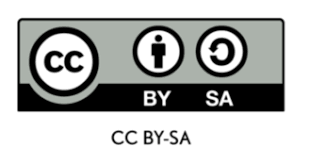

<!-- 

  

  <h3 align="center">Logo</h3>

  

    Short description
     
    <a href="https://reponame/issues/new?template=bug.md">Report bug</a>
    ·
    <a href="https://reponame/issues/new?template=feature.md&labels=feature">Request feature</a>
  

 -->
# Replication Kit for AI 4 All Course Series on Open AI Training Data for the African Context

Makerere University, Uganda
With support from the GIZ project "FAIR Forward - Artificial Intelligence for All" and the Ministry for Economic Cooperation and Development (BMZ) have developed a series of courses under the 
Artificial Intelligence for All Series on how to create open, locally relevant and unbiased AI training data for AI practitioners in Africa..

The series are targeted at researchers, developers, hobbyists and anyone interested in training AI models relevant to the African context. 

The course series is hosted on on the [atingi](atingi.org) platform and is free for all. The courses are as follows:

- [Artificial Intelligence for All: Open AI Training Data for African Languages](https://online.atingi.org/course/view.php?id=465)

- [Artificial Intelligence for All: Open AI Training Data for Earth Observation](https://online.atingi.org/course/view.php?id=467)

- [Artificial Intelligence for All: How to prepare open training data and share it for re-use by others following international standards](https://online.atingi.org/course/view.php?id=653)

- [Artificial Intelligence for All: How to eliminate or mitigate biases in Artificial Intelligence training data](https://online.atingi.org/course/view.php?id=689)

- [Artificial Intelligence for All: How to Create and Sustain Open AI Image Training Data](https://online.atingi.org/course/view.php?id=690)

<!-- Insert poster with all the courses or an image per course -->

To maximize impact, to foster re-use, we have created a replication kit to make it easy for anyone interested to:

1. Make their copy of the courses and host it on a compatible platform.
2. Make edits to the course content, including the course videos and text to fit their own context and branding or to include their original content content.

## Course Videos

The final, uninterrupted, full length course videos are located in the Videos folder. 

## Deploying your own version of the course

The files needed and the instructions on how to deploy your own versions of the courses on a SCORM compatible LMS can be found in the *SCORM* folder.
This also includes instructions on how to edit the course text.

## Replication Kit
The Replication Kit provides instructions on how one would go about editing the course video source materials to generate their version of the course. 

## Copyright and license

All materials are available as open educational resources under the Creative Commons Attribution Share-Alike(CC-BY-SA) license, can be adopted, translated  and reused. 

