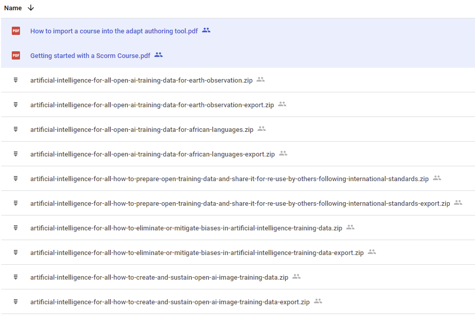

# Creating your copy of the AI 4 ALL courses

Below are the links to the course files:

- [AI 4 All Course  Materials](https://drive.google.com/drive/folders/1ceAAM4MYxXOXEa9iXHaCuvtFyBrBNEHh?usp=sharing)

https://whitedatastorage.blob.core.windows.net/open-and-unbiased-ai-training-data/ScormPackages/artificial-intelligence-for-all-how-to-create-and-sustain-open-ai-image-training-data-export.zip
https://whitedatastorage.blob.core.windows.net/open-and-unbiased-ai-training-data/ScormPackages/artificial-intelligence-for-all-how-to-create-and-sustain-open-ai-image-training-data.zip
https://whitedatastorage.blob.core.windows.net/open-and-unbiased-ai-training-data/ScormPackages/artificial-intelligence-for-all-how-to-eliminate-or-mitigate-biases-in-artificial-intelligence-training-data-export.zip
https://whitedatastorage.blob.core.windows.net/open-and-unbiased-ai-training-data/ScormPackages/artificial-intelligence-for-all-how-to-eliminate-or-mitigate-biases-in-artificial-intelligence-training-data.zip
https://whitedatastorage.blob.core.windows.net/open-and-unbiased-ai-training-data/ScormPackages/artificial-intelligence-for-all-how-to-prepare-open-training-data-and-share-it-for-re-use-by-others-following-international-standards-export.zip
https://whitedatastorage.blob.core.windows.net/open-and-unbiased-ai-training-data/ScormPackages/artificial-intelligence-for-all-how-to-prepare-open-training-data-and-share-it-for-re-use-by-others-following-international-standards.zip
https://whitedatastorage.blob.core.windows.net/open-and-unbiased-ai-training-data/ScormPackages/artificial-intelligence-for-all-open-ai-training-data-for-african-languages-export.zip
https://whitedatastorage.blob.core.windows.net/open-and-unbiased-ai-training-data/ScormPackages/artificial-intelligence-for-all-open-ai-training-data-for-african-languages.zip
https://whitedatastorage.blob.core.windows.net/open-and-unbiased-ai-training-data/ScormPackages/artificial-intelligence-for-all-open-ai-training-data-for-earth-observation-export.zip
https://whitedatastorage.blob.core.windows.net/open-and-unbiased-ai-training-data/ScormPackages/artificial-intelligence-for-all-open-ai-training-data-for-earth-observation.zip
https://whitedatastorage.blob.core.windows.net/open-and-unbiased-ai-training-data/ScormPackages/Getting started with a Scorm Course.pdf
https://whitedatastorage.blob.core.windows.net/open-and-unbiased-ai-training-data/ScormPackages/How to import a course into the adapt authoring tool.pdf


<!--  -->

## Deploying based on SCORM packages

To deploy a course based on a SCORM package, use the zip file with the export suffix on the filename. 

For example to deploy the course *Artificial Intelligence for All: Open AI Training Data for Earth Observation* you would use the file
``` text
artificial-intelligence-for-all-open-ai-training-data-for-earth-observation-export.zip
```
For the complete instructions on how to deploy the course materials, see  

```text 
Getting Started with a Scorm Course.pdf
```
## Editing the course text

This course was create using the *adapt* course authoring tool. To make edits to the course text follow the instructions in 

```text
How to import a course into the adapt authoring tool.pdf
```